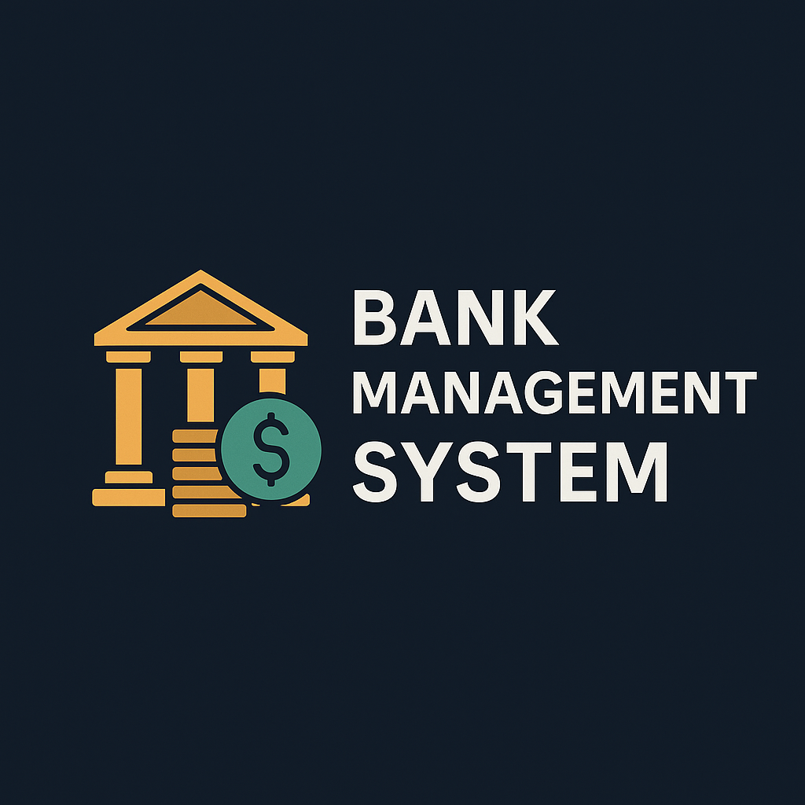

# 🏦 Bank Management System  
### A Simple & Reliable Python CLI Banking Application

---

## 🎯 What Is This Project?

The **Bank Management System** is a **command-line based Python application** that simulates fundamental banking operations while ensuring **data persistence** through file handling.

This project focuses on **clarity, reliability, and real-world logic**, making it ideal for learning and portfolio use.

---

## 👥 Who Is This For?

✅ Python beginners  
✅ College students & freshers  
✅ Developers practicing CLI applications  
✅ Job seekers preparing Python projects  

---

## 🌟 Key Features

✅ Create new bank accounts  
✅ Deposit & withdraw money  
✅ Check individual account balance  
✅ Display all existing accounts  
✅ Close bank accounts  
✅ Persistent storage using `pickle`  
✅ Automatic data loading on restart  
✅ User-friendly menu-based navigation  

---

## 🧠 Concepts Covered

- Dictionaries & control flow  
- File handling & data persistence  
- Modular function design  
- Input validation & error handling  
- Menu-driven program architecture  

---

## 🛠 Tech Stack

| Component | Details |
|---------|--------|
| Language | Python 3.x |
| Storage | Pickle (`accounts.pkl`) |
| Interface | Command Line Interface |
| OS Support | Windows / Linux / macOS |

---

## 👨‍💻 Author

**Tirupathi Rao G**
SQL Learner | Data Enthusiast | MCA Student

